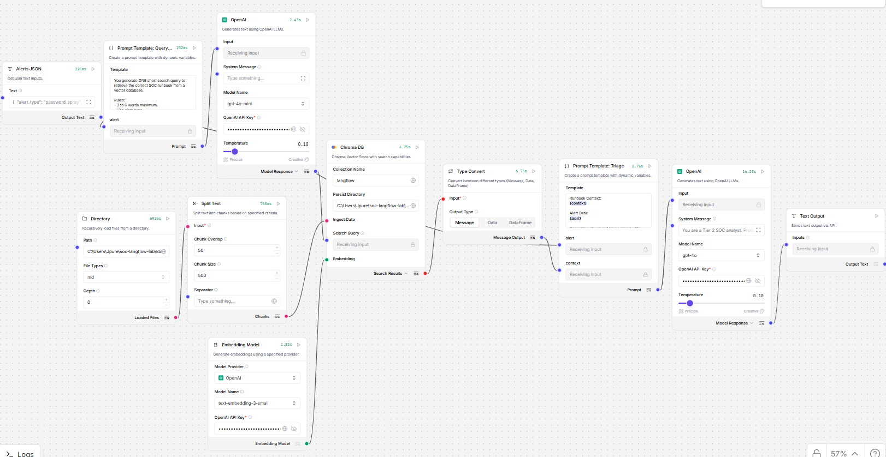

# SOC Triage Lab

A local Security Operations Center (SOC) triage system that uses **Langflow**, **ChromaDB**, and **Microsoft Sentinel** to automate alert analysis using RAG (Retrieval-Augmented Generation).

## Mission

Build an AI-assisted SOC analyst that can:
1. **Ingest** security incidents from Microsoft Sentinel in real-time
2. **Retrieve** relevant triage runbooks from a vector database
3. **Analyze** alerts using LLM-powered reasoning
4. **Output** structured triage reports with recommended actions

This system aims to reduce mean-time-to-triage (MTTT) by providing analysts with contextual runbook guidance and automated initial assessment.

---

## Current Status

| Component | Status | Notes |
|-----------|--------|-------|
| Sentinel API Integration | ✅ Complete | Service principal auth, token caching, KQL queries |
| Runbook Knowledge Base | ✅ Complete | 6 detailed runbooks with KQL queries |
| Secrets Management | ✅ Complete | `.env` file, gitignored |
| Incident Poller | ✅ Complete | Cursor-based deduplication, structured output |
| ChromaDB Vector Store | ✅ Complete | Runbook embeddings via Langflow |
| Langflow RAG Pipeline | ✅ Complete | Flow: Directory → Chroma → GPT-4o |
| Langflow API Integration | ✅ Complete | `langflow_client.py` handles API calls |
| Triage Report Generation | ✅ Complete | Structured JSON output with confidence scores |

**Phase 1 Complete** - End-to-end pipeline working: Sentinel → Poller → Langflow → Triage Reports

---

## Architecture

### System Overview

```
┌─────────────────┐     ┌──────────────────┐     ┌─────────────────┐
│ Microsoft       │     │ Incident Poller  │     │ Langflow        │
│ Sentinel        │────▶│ (Python)         │────▶│ RAG Pipeline    │
│ (Log Analytics) │     │                  │     │                 │
└─────────────────┘     └──────────────────┘     └────────┬────────┘
                                                          │
                        ┌──────────────────┐              │
                        │ ChromaDB         │◀─────────────┘
                        │ (Runbook KB)     │
                        └──────────────────┘
                                 │
                                 ▼
                        ┌──────────────────┐
                        │ Triage Report    │
                        │ (outputs/)       │
                        └──────────────────┘
```

### Langflow RAG Pipeline



**Flow Name:** SOC Triage Agent v1

#### Components

| Component | Type | Configuration | Purpose |
|-----------|------|---------------|---------|
| **Directory** | File Loader | Path: `kb/`, File Types: `md`, Depth: 0 | Load runbook markdown files |
| **Split Text** | Text Splitter | Chunk Size: 500, Overlap: 50 | Split runbooks into retrievable chunks |
| **Embedding Model** | OpenAI Embeddings | Model: `text-embedding-3-small` | Generate vector embeddings |
| **Chroma DB** | Vector Store | Collection: `langflow`, Persist: `chroma/` | Store and search runbook embeddings |
| **Alerts JSON** | Text Input | - | Receive alert JSON from API |
| **Type Convert** | Data Converter | Output Type: Message | Convert search results to message format |
| **Prompt Template** | Prompt Builder | Variables: `{context}`, `{alert}` | Build prompt with runbook context + alert |
| **OpenAI** | LLM | Model: `gpt-4o`, Temp: 0.10, System: "Tier 2 SOC analyst" | Generate triage analysis |

#### Connections

```
INGESTION PATH (runs once to populate vector store):
Directory ──► Split Text ──► Chroma DB
                               ▲
Embedding Model ───────────────┘

QUERY PATH (runs per alert):
Alerts JSON ──┬──► Chroma DB (Search Query) ──► Search Results ──► Type Convert ──► Prompt Template (context)
              │                                                                            │
              └──► Prompt Template (alert) ◄───────────────────────────────────────────────┘
                            │
                            ▼
                         OpenAI ──► Model Response (Output)
```

#### Key Design Decisions

1. **Dual Input from Alerts JSON**: The alert text feeds both the Chroma search query AND the prompt template's `{alert}` variable
2. **Type Convert**: Converts Chroma search results (Data type) to Message type for the prompt template
3. **Low Temperature (0.10)**: Ensures consistent, deterministic triage outputs
4. **Tier 2 SOC Analyst Persona**: System message instructs the LLM to act as an experienced analyst

### Data Flow

1. **Poll**: `incident_poller.py` queries Sentinel for new `SecurityIncident` records
2. **Normalize**: Raw incidents converted to structured `alert_schema` JSON
3. **Route**: Alert type inferred (e.g., `impossible_travel`, `mfa_fatigue`)
4. **Retrieve**: Langflow queries ChromaDB for relevant runbook chunks
5. **Generate**: LLM produces triage report with recommended actions
6. **Output**: Report saved to `outputs/` directory

---

## Project Structure

```
soc-langflow-lab/
├── .env                    # Secrets (NEVER commit)
├── .env.template           # Template for secrets
├── .gitignore              # Protects secrets and local data
├── README.md               # This file
├── requirements.txt        # Python dependencies
│
├── config.py               # Configuration loader
├── sentinel_client.py      # Sentinel/Log Analytics API client
├── incident_poller.py      # Polling with deduplication
├── langflow_client.py      # Langflow API client for triage
├── dashboard.py            # Web dashboard for triage reports
│
├── docs/                   # Documentation and diagrams
│   └── langflow_architecture.png
│
├── kb/                     # Runbook knowledge base
│   ├── impossible_travel.md
│   ├── mfa_fatigue.md
│   ├── oauth_consent_abuse.md
│   ├── mailbox_rule_abuse.md
│   ├── phishing_click.md
│   └── password_spray.md
│
├── chroma/                 # ChromaDB persistence (gitignored)
├── outputs/                # Generated triage reports
├── state/                  # Poller cursor state
└── venv/                   # Python virtual environment
```

---

## Runbooks

Each runbook follows a consistent structure optimized for RAG retrieval:

| Runbook | Alert Types Covered |
|---------|-------------------|
| `impossible_travel.md` | Atypical sign-in, geo anomaly, risky sign-in |
| `mfa_fatigue.md` | Push bombing, MFA spam, authentication fatigue |
| `oauth_consent_abuse.md` | Malicious app consent, illicit consent grant |
| `mailbox_rule_abuse.md` | Inbox forwarding, mail rules, BEC indicators |
| `phishing_click.md` | Safe Links clicks, credential harvesting |
| `password_spray.md` | Brute force, credential stuffing |

### Runbook Structure

Each runbook contains 12 standardized sections:

1. **Definition** - What the alert means
2. **Key Signals** - Indicators to look for
3. **Primary Logs** - Sentinel table names and sources
4. **False Positives** - Benign explanations
5. **Triage Steps** - Step-by-step investigation
6. **KQL Queries** - 6-8 ready-to-run queries with placeholders
7. **MITRE Mapping** - Tactics and techniques
8. **Containment Actions** - Response options with risk/rollback
9. **Follow-Up Investigation** - Additional checks
10. **Escalation Criteria** - When to escalate
11. **Notes for Automation** - Entity extraction, keywords, JSON schema

---

## Setup Instructions

### Prerequisites

- Python 3.10+
- Microsoft Sentinel workspace
- Entra ID service principal with **Log Analytics Reader** role
- Langflow instance (local or cloud)

### 1. Clone the Repository

```bash
git clone https://github.com/yourusername/soc-langflow-lab.git
cd soc-langflow-lab
```

### 2. Create Virtual Environment

```bash
python -m venv venv

# Windows
.\venv\Scripts\activate

# Linux/Mac
source venv/bin/activate
```

### 3. Install Dependencies

```bash
pip install -r requirements.txt
```

### 4. Configure Secrets

```bash
# Copy template
cp .env.template .env

# Edit .env with your values
```

Required variables:

| Variable | Description | Where to Find |
|----------|-------------|---------------|
| `AZURE_TENANT_ID` | Entra ID tenant | Azure Portal → Entra ID → Overview |
| `AZURE_CLIENT_ID` | App registration ID | Azure Portal → App registrations |
| `AZURE_CLIENT_SECRET` | Client secret | App registrations → Certificates & secrets |
| `LOG_ANALYTICS_WORKSPACE_ID` | Workspace ID | Log Analytics workspace → Overview |
| `LANGFLOW_FLOW_ID` | Flow ID for triage | Langflow UI → Flow URL or settings |
| `LANGFLOW_API_KEY` | Langflow API key (optional) | Langflow settings |

### 5. Grant API Permissions

Your service principal needs:

1. **Log Analytics Reader** role on the workspace:

```bash
az role assignment create \
  --assignee <CLIENT_ID> \
  --role "Log Analytics Reader" \
  --scope /subscriptions/<SUB_ID>/resourceGroups/<RG>/providers/Microsoft.OperationalInsights/workspaces/<WORKSPACE>
```

### 6. Test Connection

**PowerShell:**
```powershell
$tenantId = "<your-tenant-id>"
$clientId = "<your-client-id>"
$clientSecret = "<your-secret>"
$workspaceId = "<your-workspace-id>"

$tokenBody = @{
  client_id     = $clientId
  scope         = "https://api.loganalytics.io/.default"
  client_secret = $clientSecret
  grant_type    = "client_credentials"
}
$tokenResp = Invoke-RestMethod -Method Post `
  -Uri "https://login.microsoftonline.com/$tenantId/oauth2/v2.0/token" `
  -Body $tokenBody

$headers = @{
  "Authorization" = "Bearer $($tokenResp.access_token)"
  "Content-Type"  = "application/json"
}

$body = @{ query = "SecurityIncident | take 5" } | ConvertTo-Json

$resp = Invoke-RestMethod -Method Post `
  -Uri "https://api.loganalytics.io/v1/workspaces/$workspaceId/query" `
  -Headers $headers -Body $body

$resp.tables[0].rows.Count  # Should return a number
```

**Python:**
```bash
python sentinel_client.py
```

---

## Usage

### Start Langflow
```bash
# Set auth bypass for local dev
$env:LANGFLOW_SKIP_AUTH_AUTO_LOGIN = "true"  # PowerShell

# Run Langflow
langflow run
```

### Poll for Incidents (No Triage)
```bash
python incident_poller.py
```

### Poll and Triage via Langflow
```bash
python incident_poller.py --triage
```

### Continuous Polling with Triage
```bash
python incident_poller.py --triage --continuous
```

### Test Sentinel Connection
```bash
python sentinel_client.py
```

### Run Dashboard (for demos)
```bash
python dashboard.py
# Open http://localhost:8080
```

### Output Schema

Incidents are normalized to this structure for Langflow:

```json
{
  "alert_type": "impossible_travel",
  "incident_id": "12345",
  "title": "Sign-in from unfamiliar location",
  "severity": "high",
  "status": "New",
  "time_generated": "2024-01-15T10:30:00Z",
  "source_provider": "Azure Sentinel",
  "mitre": {
    "tactics": ["InitialAccess"],
    "techniques": ["T1078"]
  },
  "entities": {
    "users": ["user@domain.com"],
    "ips": ["1.2.3.4", "5.6.7.8"]
  },
  "description": "...",
  "incident_url": "https://portal.azure.com/...",
  "related_alert_ids": []
}
```

---

## Roadmap

### Phase 1: Data Pipeline ✅
- [x] Service principal authentication
- [x] Log Analytics API client
- [x] Incident polling with deduplication
- [x] Structured alert schema output
- [x] Runbook knowledge base (6 runbooks)
- [x] Entity-based deduplication (skip duplicate users+IPs)

### Phase 2: RAG Pipeline ✅
- [x] Embed runbooks into ChromaDB (via Langflow)
- [x] Build Langflow RAG flow (SOC Triage Agent v1)
- [x] Connect poller to Langflow API
- [x] Test retrieval accuracy

### Phase 3: Triage Automation ✅
- [x] LLM prompt engineering for triage (GPT-4o, Tier 2 analyst persona)
- [x] Structured triage report output (JSON with markdown)
- [x] Confidence scoring
- [x] Web dashboard for live visualization

### Phase 4: KQL Enrichment Agent 🔲 **← NEXT**
- [ ] KQL query generation from incident context
- [ ] Educational explanations (learn as you build)
- [ ] Execute read-only queries via Log Analytics API
- [ ] Evidence bundle generation (supporting logs + reasoning)
- [ ] Sentinel table schema knowledge base

### Phase 5: Detection Engineering Assistant 🔲
- [ ] False positive pattern detection
- [ ] Detection tuning recommendations
- [ ] MITRE coverage gap analysis
- [ ] Runbook quality scoring

### Phase 6: Multi-Agent Architecture 🔲
- [ ] Router Agent (classify incident type)
- [ ] Enrichment Agent (KQL gen + execution)
- [ ] Response Advisor Agent (containment recommendations)
- [ ] Case Manager Agent (tasks, escalation, handoff)

### Phase 7: SOAR Integration 🔲
- [ ] Guardrailed actions (suggest → approve → execute)
- [ ] Sentinel incident comments write-back
- [ ] Teams/Slack notifications
- [ ] Audit trail for all actions

---

## Vision: Multi-Agent SOC Platform

The long-term vision is to evolve from a single triage tool into a **multi-agent SOC automation platform**:

```
┌─────────────────────────────────────────────────────────────────────────────┐
│                              ORCHESTRATOR                                   │
│                  (routes, tracks state, enforces guardrails)                │
└─────────────────────────────────┬───────────────────────────────────────────┘
                                  │
            ┌─────────────────────┼─────────────────────┐
            ▼                     ▼                     ▼
     ┌─────────────┐       ┌─────────────┐       ┌─────────────┐
     │   TRIAGE    │       │ ENRICHMENT  │       │  DETECTION  │
     │   AGENT     │       │   AGENT     │       │  ENGINEER   │
     │             │       │             │       │    AGENT    │
     │ • Classify  │       │ • KQL gen   │       │ • FP review │
     │ • Retrieve  │       │ • Execute   │       │ • Tune recs │
     │ • Analyze   │       │ • Summarize │       │ • Coverage  │
     └─────────────┘       └─────────────┘       └─────────────┘
            │                     │                     │
            └─────────────────────┴─────────────────────┘
                                  │
                           ┌──────┴──────┐
                           │ Tool Library │
                           │              │
                           │ • Sentinel   │
                           │ • Graph API  │
                           │ • Threat Intel│
                           └──────────────┘
```

### Agent Responsibilities

| Agent | Purpose | Key Capabilities |
|-------|---------|------------------|
| **Triage Agent** | Initial assessment | Classify, retrieve runbooks, produce structured summary |
| **Enrichment Agent** | Evidence collection | Generate KQL, execute queries, build evidence bundle |
| **Detection Engineer** | Rule optimization | FP analysis, tuning recommendations, coverage mapping |
| **Response Advisor** | Containment planning | Recommend actions with guardrails, risk assessment |
| **Case Manager** | Workflow coordination | Tasks, assignments, escalation, handoff summaries |

### Design Principles

1. **Explainability** - Every decision includes reasoning
2. **Guardrails** - Suggest before execute, require approval for actions
3. **Portability** - Agent contracts work across SIEM platforms
4. **Measurement** - Track retrieval precision, confidence, analyst feedback

### Future Platform Capabilities

- **Automated Enrichment**: KQL generation → execution → evidence bundle
- **Detection Engineering Loop**: FP patterns → tuning recommendations → coverage gaps
- **Confidence-based Routing**: High confidence → fast lane, low → human review
- **Cross-platform Support**: Sentinel, Cortex XSIAM, QRadar, Splunk
- **Analytics Layer**: MTTT tracking, hallucination detection, regression tests

---

## Security Considerations

| Risk | Mitigation |
|------|------------|
| Credential exposure | `.env` gitignored, secrets never logged |
| Over-privileged access | Read-only `Log Analytics Reader` role |
| Token leakage | Token never printed, safe `__repr__` methods |
| Raw data in logs | Only metadata logged, not incident content |
| Sensitive data in output | `_raw` field excluded from JSON output |

---

## Contributing

1. Fork the repository
2. Create a feature branch
3. Never commit `.env` or secrets
4. Submit a pull request

---

## License

MIT License - See LICENSE file for details.

---

## Acknowledgments

- Microsoft Sentinel documentation
- Langflow project
- MITRE ATT&CK framework
